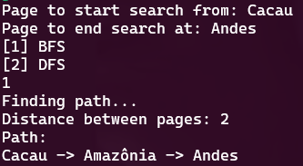
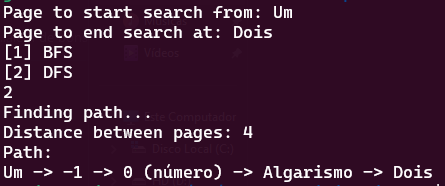

# Wikipedia Path

**Conteúdo da Disciplina**: Grafos 1<br>

## Alunos
| Matrícula | Aluno |
| -- | -- |
| 19/0014032  | Guilherme Rogelin Vial |
| 19/0033088  | Lucas Braun Vieira Xavier |

## [Vídeo](https://youtu.be/W-vfKS6r8Yc)

## Sobre 
Esse é um programa simples que procura o caminho de hyperlinks necessário para ir de uma página do Wikipedia para outra, utilizando os algoritmos de BFS ou DFS. Vale ressaltar que está sendo utilizada a Wikipedia em português para as buscas.

## Screenshots
### Busca utilizando BFS

### Busca utilizando DFS


## Instalação 
Com Python 3 instalado na máquina, primeiro faça no terminal:
```
pip install -r requirements.txt
```
E depois, basta rodar a main.py:
```
python3 src/main.py
```
